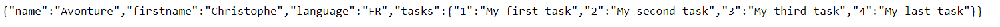
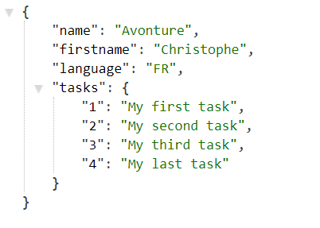

# Chrome addon - JSON Formatter

With [JSON Formatter
](https://chrome.google.com/webstore/detail/json-formatter/bcjindcccaagfpapjjmafapmmgkkhgoa), the browser will show a nice JSON tree approach.

Instead of showing RAW data like

Chrome will automatically display

Nothing to do :wink:
