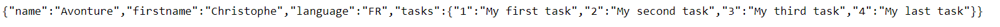
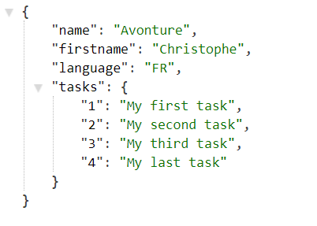

# JSON tips

> Tips and tricks to work with json format

<!-- table-of-contents - start -->
* [Tools](#tools)
    * [Chrome addon - JSON Formatter](#chrome-addon-json-formatter)
    * [Encode](#encode)
    * [Linter](#linter)
    * [Sort online](#sort-online)
<!-- table-of-contents - end -->

## Tools

### Chrome addon - JSON Formatter

With [JSON Formatter
](https://chrome.google.com/webstore/detail/json-formatter/bcjindcccaagfpapjjmafapmmgkkhgoa), the browser will show a nice JSON tree approach.

Instead of showing RAW data like

Chrome will automatically display

Nothing to do :wink:

### Encode

Very straight-forward script for encoding string in JSON: [https://github.com/cavo789/json_encode](https://github.com/cavo789/json_encode)

### Linter

A very simple online json beautifier: [https://github.com/cavo789/jsonlint](https://github.com/cavo789/jsonlint)

### Sort online

Nice online tool for sorting json based on their keys: [https://andreruffert.github.io/jsonsort/](https://andreruffert.github.io/jsonsort/)
